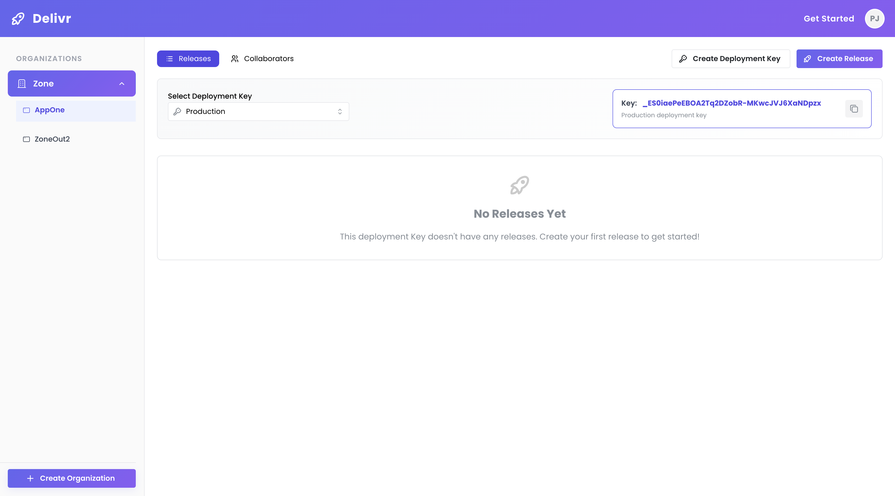
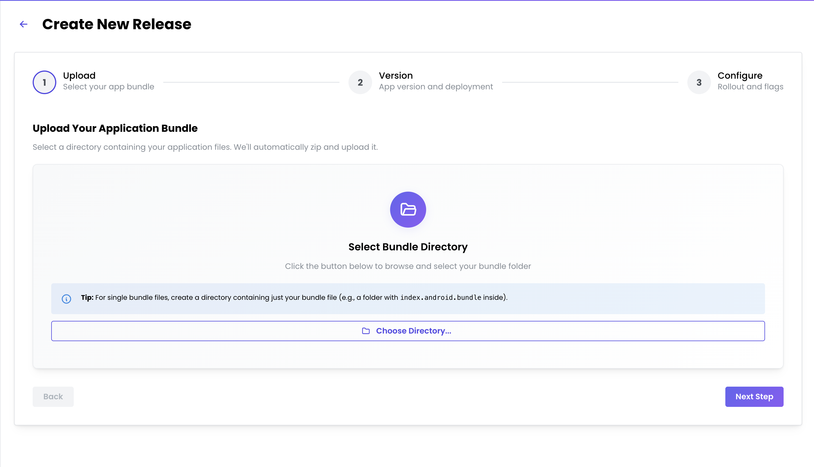
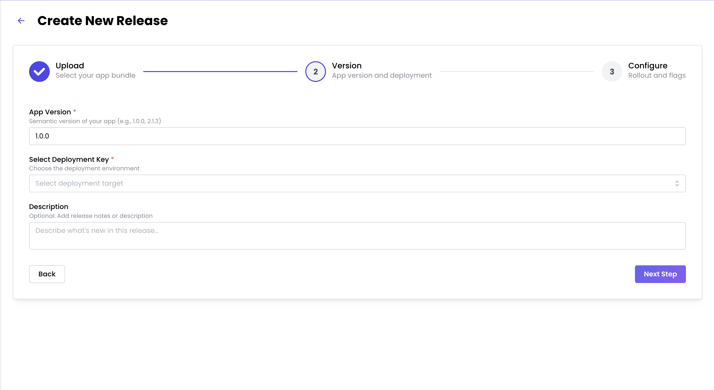
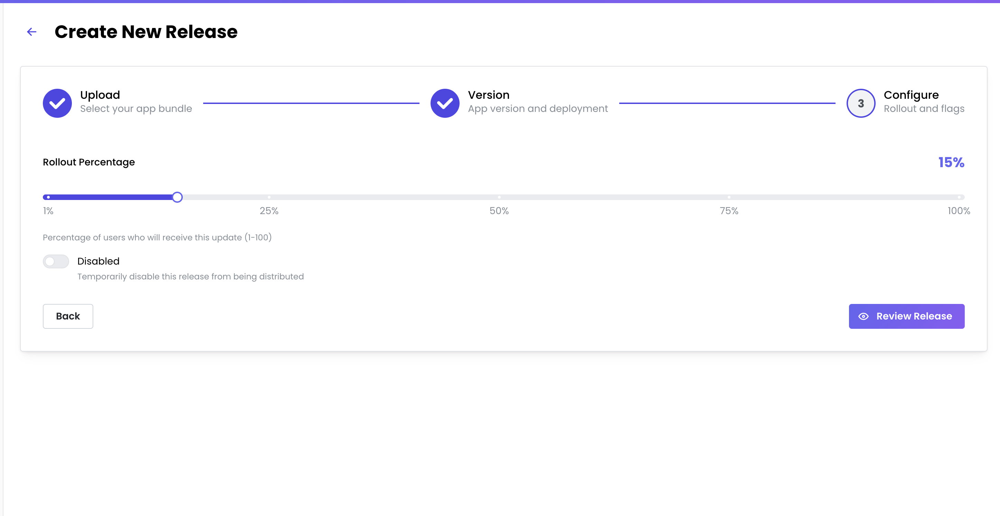
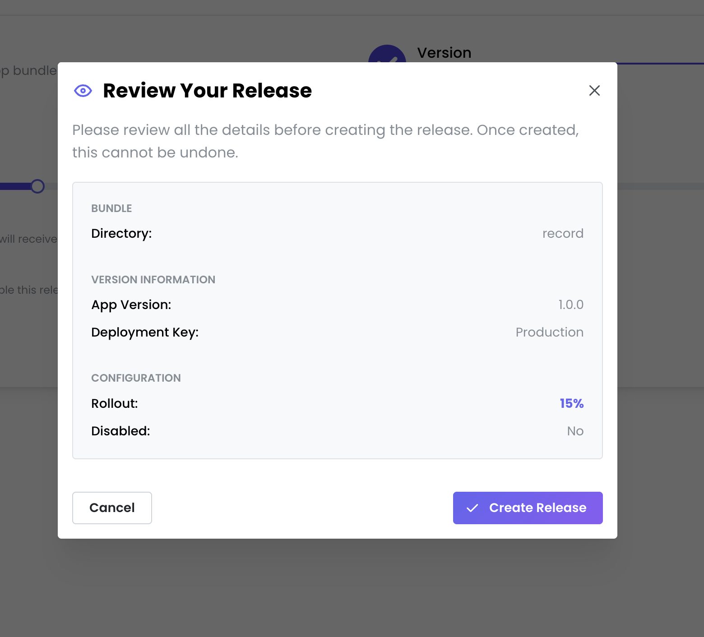

# Delivr Dashboard

A modern web interface for the mobile dev-ops platform, enabling seamless application build, deployment and release management.

## 🚀 Quick Setup

### Prerequisites
- Node.js 18.18.0 (exact version required)
- Corepack (for package manager version management)
- pnpm 10.17.0+ (managed by corepack)

### Installation & Development

```bash
# Install and enable corepack (required for proper pnpm version management)
npm install -g corepack
corepack enable

# Install pnpm (if not already installed)
npm install -g pnpm

# Install dependencies
pnpm install

# Set up environment variables
cp .env.example .env
# Edit .env with your configuration values
```

### Environment Configuration

Create a `.env` file in the root directory with the following variables:
**Required Configuration:**
- **GOOGLE_CLIENT_ID/SECRET**: From Google Cloud Console OAuth setup
- **DELIVR_BACKEND_URL**: URL of your local Delivr Backend server

```bash

# Google OAuth Configuration
GOOGLE_CLIENT_ID=your-google-oauth-client-id.apps.googleusercontent.com
GOOGLE_CLIENT_SECRET=your-google-oauth-client-secret

# Backend API Configuration  
DELIVR_BACKEND_URL=http://localhost:3010

```


### Backend Setup
Before running the dashboard, you'll need the Delivr Backend running locally.

📖 **[Backend Repo](https://github.com/ds-horizon/delivr-server-ota)** - Follow the server repo to run the backend locally.

### Start Development

```bash
# Start development server
pnpm dev
```

The app will be available at `http://localhost:5173`

### Production Build

```bash
# Build for production
pnpm build

# Start production server
pnpm start
```

### Additional Commands

```bash
# Run unit tests
pnpm test

# Run E2E tests (requires mock server - see E2E_TESTING_GUIDE.md)
pnpm test:e2e              # Headless mode
pnpm test:e2e:headed        # Visible browser
pnpm test:e2e:ui           # Interactive UI mode
pnpm test:e2e:debug        # Debug mode

# Run linting
pnpm lint

# Type checking
pnpm typecheck

# Generate routes and config
pnpm gen:routes && pnpm gen:config
```

### Documentation

- **[E2E Testing Guide](./E2E_TESTING_GUIDE.md)** - Complete guide for running and maintaining end-to-end tests

### E2E Testing

For complete E2E testing setup and instructions, see **[E2E_TESTING_GUIDE.md](./E2E_TESTING_GUIDE.md)**.

**Quick Start:**
1. Start mock server: `cd code-push-server/e2e-mocks && docker-compose up -d && ./register-expectations.sh`
2. Run tests: `pnpm test:e2e:headed`

## 📱 How to Use Delivr

### 🎯 What You Can Do

**Deploy your mobile apps effortlessly** - Push updates to users without app store delays. Perfect for React Native apps.

### 🚀 Getting Started (5 Minutes)

#### Step 1: Install Delivr SDK in Your Mobile App

Integrate the SDK into your app to enable over-the-air updates.
[DOTA SDK Doc](https://github.com/ds-horizon/delivr-sdk-ota?tab=readme-ov-file#getting-started)

#### Step 2: Set Up Your Dashboard Account
- Sign in with your Google account
- Create your organization (company workspace)
- Create your first app inside the organization
- Generate deployment keys for your app

#### Step 2a: Generate API Tokens (Optional)
API tokens are used to authenticate API calls from the CLI or CI/CD pipelines.

**To generate an API token:**
1. Navigate to the **Tokens** page from the dashboard sidebar
2. Click **"Create Token"** button
3. Enter a descriptive name for your token (e.g., "CI Pipeline Token", "CLI Access")
4. Select the access level:
   - **All**: Full read and write access
   - **Write**: Create and update deployments
   - **Read**: View deployments and app information only
5. Click **"Create Token"** - your token will be generated
6. **Important**: Copy the token immediately and store it securely (you won't be able to see it again)
7. Use this token in your CLI or API calls for authentication

**Managing Tokens:**
- View all your tokens in the Tokens page
- Delete tokens you no longer need by selecting them and clicking "Delete"
- Create multiple tokens for different purposes (CI/CD, local development, team members)

#### Step 3: Configure Your App with Deployment Keys
- Copy the deployment keys from the dashboard
- **Important**: Burn these keys into your mobile app code
- Release your app to App Store/Play Store with the embedded keys
- Now you're ready to send DOTA updates!

#### Step 4: Deploy Updates
You can send DOTA updates in two ways:
- **Web Dashboard**: Upload and deploy directly through this interface

Deploying via Web Dashboard:

1. **Click "Create Release"**
   
   

2. **Step 1** - Upload Your Application Bundle
   
   

3. **Step 2** - App version and deployment details
   
   

4. **Step 3** - Rollout and flags config
   
   

5. **Review Changes** - Review detail card
   
   


- **Delivr CLI**: Deploy from your terminal/CI pipeline [Cli-Release Management](https://github.com/ds-horizon/delivr-cli?tab=readme-ov-file#release-management)

The dashboard shows **all deployments** regardless of how they were sent.

### 📋 Common Workflows

#### 🔄 **Deploying a New DOTA Update**
```
Your workflow: Code → Build → Upload to Delivr → Deploy
```
1. **Make Changes**: Update your React Native code (JS/assets only)
2. **Choose Deployment Method**:
   - **Web Dashboard**: Upload bundle directly through the UI
   - **CLI**: Use command from your build pipeline [Cli Documentation](https://github.com/ds-horizon/delivr-cli)
3. **Target Deployment**: Select which deployment key to push to
4. **Monitor**: Track and update adoption and rollout progress in the dashboard


#### 🔧 **Managing Multiple Deployment Keys**
- **Staging Deployment**: For internal testing and QA
- **Production Deployment**: Live updates to end users
Each deployment key represents a different update channel for your app.

### 🔧 Advanced Features

#### **Deployment Control Options**
- **🔒 Mandatory Updates**: Force users to install critical updates before app usage
- **⏸️ Disabled Updates**: Temporarily pause deployments without rollback
- **📊 Gradual Rollouts**: Control release percentage to manage risk (e.g., 10% → 50% → 100%)
- **🎯 Conditional Releases**: Target specific app versions, OS versions, or user segments

#### **Versioning**
- **📦 Binary Compatibility**: Updates only work with compatible native app versions
- **📱 Multi-Version Support**: Different updates for different base app versions
- **🔗 Version Targeting**: Deploy specific updates to specific app version ranges


#### **Patching**
- **🔄 Delta Patching**: Efficient downloads by sending only diff between two bundles
- **🏷️ Patch-Tagged Releases**: When you see "patch" tagged releases in dashboard, it means a bundle diff patch was sent
- **⚠️ CLI-Only Patches**: Patch releases can only be created via CLI, not web dashboard
- **🛡️ Automatic Fallbacks**: Revert to previous version if update fails


#### **Analytics & Monitoring**
- **📈 Adoption Metrics**: Real-time install rates and user adoption tracking
- **🚨 Error Reporting**: Monitor update failures and crash rates
- **⏱️ Performance Data**: Download times and success rates by region
- **📊 Version Distribution**: See which versions your users are running

### 💡 Key Benefits

- **⚡ Instant Updates**: Deploy bug fixes and features without waiting for app store approval
- **🎯 Targeted Releases**: Deploy to specific user segments or regions
- **🔄 Easy Rollbacks**: Instantly revert to previous versions if issues arise
- **📊 Real-time Monitoring**: See deployment progress and success rates live
- **🔒 Secure**: Enterprise-grade security with role-based team access

### ❓ Common Questions

**Q: What are deployment keys?**  
A: Secure tokens linked to your app that identify where DOTA updates should be delivered. You generate them in the dashboard, burn them into your app code, and use them to target deployments.

**Q: Do I need to update my app in the store every time?**  
A: No! Once you've released your app to the store with Delivr SDK and deployment keys, you can send JavaScript/asset updates instantly via DOTA without store approval.

**Q: Can I deploy from both dashboard and CLI?**  
A: Yes! The web dashboard shows all deployments whether they came from the UI or CLI. Use whatever fits your workflow better.

**Q: What happens if I need to rollback?**  
A: Deploy a previous working version using the same deployment key. Users will receive the rollback update just like any other DOTA update.

**Q: How do deployment keys work with app store releases?**  
A: Deployment keys must be "burnt" (hardcoded) into your app during development. When you release to app stores, those keys are embedded. Later, DOTA updates use those same keys to identify your app.

## 🏗️ System Architecture

### Complete DOTA Ecosystem


### How DOTA Works End-to-End

#### 🔄 **Update Delivery Flow**
1. **App Release**: React Native app with Delivr SDK published to app stores
2. **DOTA Creation**: Developer creates update via Web Dashboard or CLI
3. **Bundle Storage**: Update bundle stored in Delivr infrastructure
4. **Update Check**: Mobile app periodically checks for updates via Delivr Backend
5. **Download & Apply**: App downloads and applies JavaScript/asset updates instantly

#### 🛠️ **Developer Integration Points**
- **Mobile App**: Delivr SDK embedded for OTA update capabilities
- **Web Dashboard**: Visual interface for managing apps, deployments, and monitoring
- **CLI Tool**: Command-line interface for automated CI/CD deployments
- **Backend API**: Central orchestration and bundle management

#### 🌐 **Infrastructure Components**
- **Delivr Backend**: Core API server managing apps, deployments, and update delivery
- **CDN**: Global content delivery network for fast bundle downloads
- **Bundle Storage**: Secure storage for all DOTA update packages
- **Authentication**: OAuth-based secure access control across all components

### Key Benefits of This Architecture
- **Zero App Store Dependency**: Updates bypass store approval process
- **Global Scale**: CDN ensures fast updates worldwide  
- **Unified Management**: Single dashboard shows all deployments (web + CLI)
- **Secure Delivery**: Deployment keys ensure updates reach correct app versions
- **Developer Flexibility**: Multiple deployment methods (manual, automated, CI/CD)

---
